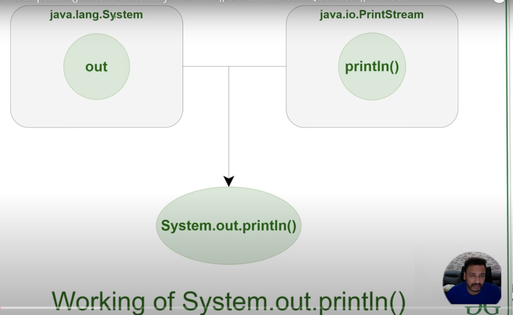
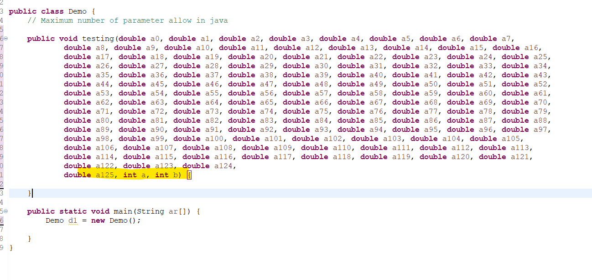
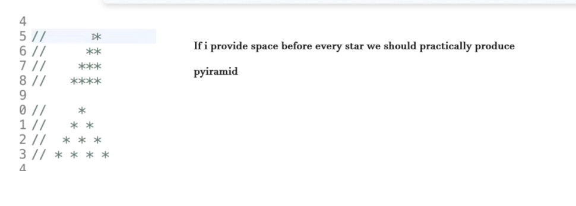
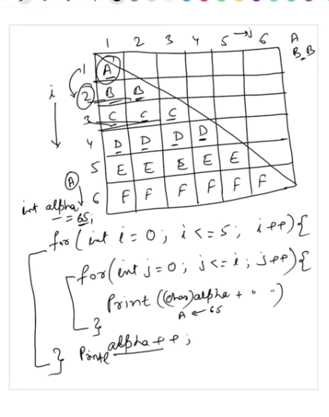

# 1. Print from 1 to 100 without using numbers in your code.

## Print number form 1 to 100 with using numbers in for loop
```java
package com.adi;

public class PrintOneToHundred {

	public static void main(String[] args) {
		
		for(int i=1; i<=100;i++) {
			System.out.println(i);
		}
	}
}

```
    Output- Number for 1 to 100 is printed

## Pring from 1 to 100 without using number
```java
package com.adi;

public class PrintOneToHundred {

	public static void main(String[] args) {
	
		//Using character literal
		int one = 'A'/'A';  //1 
		
		String s1 = ".........."; //length of string is 10
		
		for(int i = one; i<= (s1.length()*s1.length());i++) {
			System.out.println(i);
		}
	}
}

```
    Output- Number for 1 to 100 is printed

## Another way via askii value
```java
package com.adi;

public class PrintOneToHundred {

	public static void main(String[] args) {	
		
		int one = 'A'/'A';  //1 
		
		for(int i = one; i<= 'd';i++) {
			System.out.println(i);
		}
	}
}
```
     Output- Number for 1 to 100 is printed

# 2. Print 1 to 100 whithout using for/while/do-while loop in code.

## via recursive function
```java
package com.adi;

public class PrintOneToHundred {

	public static void main(String[] args) {	
		
	//via recursive function - a function calling itself
		
		printNum(1);
	}
	
	public static void printNum(int num) {
		
		//maximum range of number is 100 
		if(num <= 100) {
				
			//print
			System.out.println(num); //1 2 3 4 .....100
			
			//increment
			num++;
			
			//calling same function
			printNum(num);
		}	
	}
}

```
     Output- Number for 1 to 100 is printed

## via recursive function but generic method
```java
package com.adi;

public class PrintOneToHundred {

	public static void main(String[] args) {	
		
	//via recursive function but generic method
		
		printNum(1,100);
	}
	
	public static void printNum(int startnum, int endNumber) {
		
		//maximum range of number is endNumber
		if(startnum <= endNumber) {
				
			//print
			System.out.println(startnum); 
			
			//increment
			startnum++;
			
			//calling same function
			printNum(startnum,endNumber);
		}	
	}
}

```
       Output- Number for 1 to 100 is printed
## Via Integer Stream
```java
package com.adi;

import java.util.stream.IntStream;

public class PrintOneToHundred {

	public static void main(String[] args) {

		// via Integer stream

		// IntStream having method range(startInclusive,endExclusive)
		
		IntStream.range(1, 101).forEach(i -> System.out.println(i));

	}

}
```
     Output- Number for 1 to 100 is printed
# 3. Print from 1 to 100 without using any loop or recursion.
## via Arrays.fill()
```java
package com.adi;

import java.util.Arrays;
import java.util.stream.IntStream;

public class PrintOneToHundred {

	public static void main(String[] args) {

		//via Arrays fill :
		
		//create a object array and giving it size as 100(since we have to print from 1 to 100
		Object num[] = new Object[100];
		
		// In Arrays we have fill() method containting 2 argument
		// 1st arg - > array to be filled 
		// 2nd arg - >value to be stored in all element of the array
		
		Arrays.fill(num, new Object() {
			
			int count =0; //maintian a variable
			
			
			// Returns an  object representing the specified integer and return as string
			@Override
			public String toString() {
				
				return Integer.toString(++count);
			}
		});
		
		//What we do in above method?
		// Take 1st variable ie. 0
		//  in 2nd case we filled it as 1
		
		//This process is repeated till
		// when 1st arg is 99 
		// value is filled with 100
		
		
		//For printing
		System.out.println(Arrays.toString(num));
		
		
	}

}
```
Output:


## via BitSet
```java
package com.adi;

import java.util.BitSet;

public class PrintOneToHundred {

	public static void main(String[] args) {

		// via BitSet class

		// create an object of BitSet() import from util
		// you have to set some value {{}}

		// Sets the bit at the specified index to the specified value.
		// 	Parameters:
			// 1st arg -> bitIndex a bit index
			// 2nd arg -> value a boolean value to set

		// whatever value u set convert it to toString()

		String s = new BitSet() {
					{
						set(1, 101);
					}
				}.toString();
				
		// here we use append() containing 3 things
				// 1 st ->character sequence
				//2nd -> start
				//3rd -> end
		//  out.print(csq.subSequence(start, end).toString())
		// this method behave like this		
		
		System.out.append(s, 1, s.length());

	}

}
```
Output:


# 4. Print HelloWorld without using semicolon in java.
## Print via semicolon
```java
package com.adi;

public class Demo {

	public static void main(String args[]) {
		
		System.out.println("Hello World!");
	}
}

```
    Output : Hello World!
## via Printf() method
```java
package com.adi;

public class Demo {

	public static void main(String args[]) {
		
		//Printf() get formatted String
        // formaatted -> the way in which something is arranged or set out:
		
		if(System.out.printf("Hello World!") == null) {
			
		}
		//Condition definately fail but out put is printed.
	}
}

```
    Output : Hello World!

## via append
```java
package com.adi;

public class Demo {

	public static void main(String args[]) {
		
		//via append
		
		if(System.out.append("Hello World!") == null) {
			
		}
		
	}
}

```
    Output : Hello World!
## samething via .equals method
```java
package com.adi;

public class Demo {

	public static void main(String args[]) {

		// via append
		if (System.out.append("Hello World!" + "\n").equals(null)) {

		}

		if (System.out.printf("Hello World!").equals(null)) {

		}

	}
}

```
    Output : same 
## via for loop
```java
package com.adi;

public class Demo {

	public static void main(String args[]) {

		// via for loop

		for (int i = 0; i < 1; System.out.println("Hello World!")) {

			i++;
		}
		
		//For printing we won't use semicolon here
	}
}

```
    Output : same

# 5. Compare two integer number(integer caching) in java

```java
package com.adi;

public class Demo {

	public static void main(String args[]) {

		Integer num1 = 100;
		Integer num2 = 100;
		
		if(num1 == num2) {
			System.out.println("both are equal");
		} else {
			System.out.println("both are not equal");
		}
		
		// == compare refrence 
		
		// num1 and num2 are totally different object & having diff refrence 
		// but o/p => both are equal
		
		System.out.println("=================");
		
		Integer num3 = 190;
		Integer num4 = 190;
		
		if(num3 == num4) {
			System.out.println("both are equal");
		} else {
			System.out.println("both are not equal");
		}
		
		// o/p => both are not equal
		
		//This is happen bcaz of Integer caching
		//Integer caching range is -128 to 127
		// If you give number in this range then Integer caching is happen
		
		
		Integer num5 = 120;
		Integer num6 = 120;
		
		if(num5 == num6) {
			System.out.println("both are equal");
		} else {
			System.out.println("both are not equal");
		}
		
		//O/p : Both are equal
		//Same thing happen for negative number
		
		//This feature was introduced in Java 5 in order to improve memory management. 
		// Java keeps holds variable value in integer cache in range of -128 to 127
		//This Integer Cache works only on autoboxing 
		
		
		int num7 = -128;
		int num8 = -128;
		
		if(num7 == num8) {
			System.out.println("both are equal");
		} else {
			System.out.println("both are not equal");
		}
		//autoboxing is there from java5 onwards
		//o/p : Both are equal
	}
}

```
# 6. What is NAN? Not a number, How nan is defined in diff language.

## What is Nan?
Not a number i.e undefined number  
When u perform floating point operation like sqrt of negative number, modulus, divide by 0.0

```java
package com.adi;

public class Demo {

	public static void main(String args[]) {

		//System.out.println(2/0); or 0/0  same result Exception in thread "main" java.lang.ArithmeticException: / by zero
		
		System.out.println(1.0 /0.0); // or 2.0/0.0 or 1/0.0    ===>  Infinity		
	
		System.out.println(0.0/0.0); // NaN    This number is actually not defined
		
		System.out.println(Math.sqrt(-1)); //NAN sqrt of negative number is not defined
		
		System.out.println(2.1 % 0); // NaN
		
    	//System.out.println(1 % 0); // Exception in thread "main" java.lang.ArithmeticException: / by zero
		
		
	}
}

```

```java
package com.adi;

public class Demo {

	public static void main(String args[]) {
		
		//Generate a NaN number
		System.out.println(Float.NaN); // NaN 
		
		//Compare NaN number with another one
		System.out.println(Float.NaN == Float.NaN); //false 2 NaN numbers are not equal
		
		System.out.println(Float.NaN != Float.NaN); //true
		
		double nan = 2.1 % 0;
		
		System.out.println((2.1 % 0) == nan); //false
		
		System.out.println(nan == nan); //false
		
		
	}
}
```
# 7. What will be the output when you divide the number by zero?

```java
package com.adi;

public class Demo {

	public static void main(String args[]) {
		
		//Number  = Integer , Double , Float
		
		//Arithmetic exception happen only in case of Integer		
		//Integer
//		System.out.println(9/0);  Exception in thread "main" java.lang.ArithmeticException: / by zero		
//		System.out.println(0/0); Exception in thread "main" java.lang.ArithmeticException: / by zero		
		System.out.println(10 /0.0); // Infinity
		
		//Floatig or Double		
		//A floating or double number if divide by 0 or 0.0 it will give infinity
		System.out.println(9.0 / 0); //Infinity		
		System.out.println(9.1F/0); // Infinity		
		System.out.println(91.99D / 0); //Infinity		
		System.out.println(9.0 / 0.0); // Infinity
		
		System.out.println(0.0 /0); //NaN 0.0 is undefined number
		System.out.println(0.0 /0.0); //NaN	
		
	}
}
```
# 8. What's output when print a long number with L or without L suffix in Java?
```java
package com.adi;

public class Demo {

	public static void main(String args[]) {
		
		// 1000 * 60 * 60 * 24 * 365 = 31536000000
		
		long longNumberWithoutL = 1000*60*60*24*365;
		long longNumberWithL = 1000*60*60*24*365L;
		
		System.out.println(longNumberWithoutL);//1471228928
		
		System.out.println(longNumberWithL);//31536000000
		
				
		// 31536000000 -- 36 bits representation
			//Decimal to binary conversion
			//11101010111101100010010110000000000   
		
		// Max limit of integer : 2147483647 i.e 32 bits
//		System.out.println(Integer.MAX_VALUE);2147483647
		
		//so it will cut 4 bits from left side in above binary number 
		//java will truncate 4 Most significant bits in order to get 32 bits
		// 1010111101100010010110000000000  i.e 1471228928
		
	}
}

```
# 9. What is the MIN_Value of Double and Float in java?
```java
package com.adi;

public class Demo {

	public static void main(String args[]) {
	
		//In case of Double or Float their minimum value is positive number
		System.out.println(Double.MIN_VALUE);// 4.9E-324  is a positive number		
		System.out.println(Float.MIN_VALUE);//1.4E-45 is a positive number
		
		System.out.println(Long.MIN_VALUE); // -9223372036854775808  is a negative number
		System.out.println(Integer.MIN_VALUE); // -2147483648 is a negative number
		
		
		//Compare Double.MIN_VALUE with 0.0d which one is lowest?
		System.out.println(Math.min(Double.MIN_VALUE, 0.0d)); // 0.0 The Double.MIN_VALUE is greater than 0.0d
		System.out.println(Math.min(Float.MIN_VALUE, 0.0f));// 0.0
		
		//Compare Integer min value with 0
		System.out.println(Math.min(Integer.MIN_VALUE, 0));// -2147483648  0 is greater in case of Integer
		
		
		//Which one is bigger Double.MIN_VALUE or NEGATIVE_INFINITY
		
		System.out.println(Double.NEGATIVE_INFINITY); // -Infinity
		System.out.println(Math.min(Double.MIN_VALUE, Double.NEGATIVE_INFINITY)); // -Infinity
		
	}
}

```

# 10. Will Static Block be executed with final Variable?


```java
package com.adi;

public class Demo {

	public static void main(String args[]) {
	
		System.out.println(Main.x);
	}	
}

class Main{
	
	public static int x = 100;
	
	static {
		System.out.println("Main- class Static block...");
	}
}
```
## What will be the output in above case?
Will static block execute along with variable or what

    Output: 
    Main- class Static block...
    100

## What happen in case of static final keyword?

 IN order to improve performance   
 this Main.x is final so it's actually replaced with 100   in dot class file or byte code  
		so it is represent 100   
		It will directly take value of x

It will not  load the main class


Check via online code decompiler

# 11. How many String Objects will be created? String Object and String Constant pool

You can create String object via  2 types. 
1) via String literals
2) via String objects

## Via String Objects


So whenever we create String object via new keyword, One object is created in side heap memory and one object created inside SCP(provided it is not present earlier.)

SCP is created for memory optimization/ performance.


SCP mein New World pehle se hai toh wapas se create nahi karenga n2 usme New World

## Via String literal
String s1 ="Hello World";


When you create s3 = "Hello World"; It is already their in SCP so  it won't create.
Whenever you create object with string literal, the object is created in SCP but before that it will check inside SCP that the object is already present or not. And if present won't create if not then create.

```java
package com.adi;

public class Demo {

	public static void main(String args[]) {
	
		String s1 = "Hello World";
		String s2 = "Hello World";
		String s3 = s1;
		
		String n1 = new String("Hello World");
		String n2 = new String("Hello World");
		
		/*
		 * How many String object will be created?
		 *      3 (1 in SCP 2 in heap)
		 * */
		
		System.out.println(s1 == s2); // true
		System.out.println(s2 == s3); // true
		System.out.println(s1 == s3); // true

        System.out.println(n1 == n2); // false
        System.out.println(n1 == s3); // false

        // == operator compare refrences
	}	
}


```


# 12. Pass null argument with method overloading of String and Object types

```java
package com.adi;

public class Demo {

	public static void main(String args[]) {
	
		// method overloading - With in same class - same method name but diff types of parameter
		//		sequence of parameter is also diff is called method overloading 
		
		
		Demo.test(1, 1.2F); // Hello test Int float
		Demo.test(3.4F, 1); // Hello test  float   Int
		
	}	
	
	public static void test(int a, float b) {
		System.out.println("Hello test Int float");
	}
	
	public static void test( float b, int a) {
		System.out.println("Hello test  float   Int");
	}
}

```

```java
package com.adi;

public class Demo {

	public static void test(Object o) {
		System.out.println("Object Argumnet");
	}
	
	public static void test(String s) {
		System.out.println("String Argumnet");
	}
	
	
	public static void main(String args[]) {
	
		//Object is superclass of String, and both can have null values
		
		test(null); // String Argumnet

		//For null String is quite obvious data type. So Compiler will go with String
	
	}	

}


```

## What happen with try to overload with StringBuffer or StringBuilder


# 13. Top 10 Static & Instance block based interview question.

## Explain static block in java?

```java
package com.adi;

public class Demo {

	//static block is written using static keyword
	static {
		System.out.println("static block");
	}
	
	
	public static void main(String args[]) {	
		
	}	

}
```
    output: static block
When you run the main method of class. The class load itself and static block is execute.

```java
package com.adi;

public class Demo {

	//static block is written using static keyword
	static {
		System.out.println("static block");
	}
	
	
	public static void main(String args[]) {	
		
		System.out.println("Main method");
	}	

}
```
      Output : static block   
               Main method

Whenever Jvm load the class the static class is executed even before main method.

### Can we have n number of static block. Yes
```java
package com.adi;

public class Demo {

	
	static {
		System.out.println("static block 1");
	}
	static {
		System.out.println("static block 2");
	}
	
	
	public static void main(String args[]) {	
		
		System.out.println("Main method");
	}	

}

```
    Output : static block 1
             static block 2
                Main method

### static block is written anywhere in your class. The output is in what matter you written .
```java
package com.adi;

public class Demo {

	
	static {
		System.out.println("static block 5");
	}
	static {
		System.out.println("static block 2");
	}
	
	
	public static void main(String args[]) {	
		
		System.out.println("Main method");
	}	
	
	static {
		System.out.println("static block 1");
	}
	static {
		System.out.println("static block 3");
	}
}
static block 5
static block 2
static block 1
static block 3
Main method

```
## Q.2) How can we run a java program without making any object?
```java
package com.adi;

public class Demo {

//Static block is called when you load the class	
	static {
		System.out.println("Static block");
	}
	
//U need call explicitly to static method
	public static void test() {
		System.out.println("testing method");
	}

//This main() method will be called by Jvm
	public static void main(String arg[]) {
		System.out.println("main method");
	}
}
Static block
main method
```

```java
package com.adi;

public class Demo {


	static {
		System.out.println("Static block");
	}
	

	public static void test() {
		System.out.println("testing method");
	}


	public static void main(String arg[]) {
		System.out.println("main method");
		
		//IN order to call static method
		test(); // call direclty or with class name
		Demo.test();
	}
}
Static block
main method
testing method
testing method

```

U don't require object in order to run the static method. And static block will be directly called at the time of class loading.

## What is the similarity between static block and static method.

### Similarity :
Both are static in nature.  
We don't need to create the object in order to call them.

### difference :
static block will be called in the moment when class is loaded.  
static method will not be called automatically, we need to call it explicitly either by direct calling or using by class name.

## can we call static method from another static method.
```java
package com.adi;

public class Demo {


	static {
		System.out.println("Static block");
	}
	

	public static void test() {
		System.out.println("testing method");
	}

	//Can we call static method i.e test() method inside another static i.e cover() method
	public static void cover() {
		System.out.println("Cover method");
		test();
	}


	public static void main(String arg[]) {
		System.out.println("main method");
	
		cover();
	}
}

Static block
main method
Cover method
testing method
```
## How can we create an objects if we make our constructor private.
We can do this via 1) static block 2) static mehtod

```java
package com.adi;

public class Demo {

	//How can we create an objects if we make our constructor private
	
	int age;
	
	//We can create object of this class inside this class since this constructor 
	// can only access within the class.
	// outside of the class it is not accessible.
	private Demo() {
		age =30;
	}
	
	public static void main(String arg[]) {
		
		Demo demo = new Demo();
		System.out.println(demo.age);
	}
}

30
```
### Can we access this object outside of class


### via static method
```java
package com.adi;

public class Demo {

	
	int age;
	
	public static int createObject() {
		
		Demo demo = new Demo();
		demo.age=40;
		
		return demo.age;
	}

	private Demo() {
		age =30;
	}
	
	public static void main(String arg[]) {
	
	}
}
```
```java
package com.adi;

public class Test {
	
	public static void main(String arg[]) {
		
		int i = Demo.createObject();
		System.out.println(i);//40
		
	}
}

```
### via static block
```java
package com.adi;

public class Demo {

	
	 static int age;
	
	static {		
		age=50;
	}
	
	public static int createObject() {
		
		return age;
	}

	private Demo() {
		age =30;
	}
	
	public static void main(String arg[]) {
	
	}
}
```
```java
package com.adi;

public class Test {
	
	public static void main(String arg[]) {
		
		System.out.println(Demo.createObject());
	
	}
}

```
## Is it possible to compile and run java program without writing main() method?

```java
package com.adi;

public class Demo {

	//Is it possible to compile and run java program without writing main() method?
	//Yes
	//Here we create 2 static method.
	// If we need to compile and run this pgm then.
	
	static {
		System.out.println("Inside static block1");
	}
	
	static {
		System.out.println("Inside static block2");
	}
}
```
```java
package com.adi;

public class Test {
	
	public static void main(String arg[]) {
		
	Demo demo = new Demo();
	
	
	}
}
Inside static block1
Inside static block2
```
### another approach
```java
package com.adi;

public class Demo {

	static int age = 20;
	
	static {
		System.out.println("static 1");
	}
	
	static {
		System.out.println("static 2");
	}
}
```
```java
package com.adi;

//client class 
public class Test {
	
	public static void main(String arg[]) {
		
		System.out.println(Demo.age);
	
	
	}
}
static 1
static 2
20
```
## Can we initialize member variable within static block.
```java
package com.adi;

public class Demo {

	//Can we initialize member variable withing static block
	
	String name;
	
	static {
		
		Demo d = new Demo();
		d.name="ADitya"; // we can initialize memeber variable within static block.
	}
	
	public static void main(String ar[]) {
		
	}
}
```
```java
package com.adi;

public class Demo {
	
	String name;
	static int age;
	
	static {
		
		Demo d = new Demo();
		d.name="ADitya";
		age =34; // we can easily initialize static variable inside static block
		
		System.out.println(d.name +", "+ age); //ADitya, 34
		
	}
	
	public static void main(String ar[]) {
		
	}
}
```

## What will be the output

```java
package com.adi;

public class Demo {

	//static block
	static {
		System.out.println("Static block");		
	}
	
	public static final int x = 20;
	
	public static void main(String ar[]) {
		System.out.println(Demo.x); // 20
		//This is called compiler optimization, Compiler will do performance activity here. 
		//In order to improve performance Demo.x is replace by 20 at compile time in dot class 
		//file  since  x is final static in nature.
		
	}
}
```
### 2nd
```java
package com.adi;

public class Demo {

	//static block
	static {
		System.out.println("Static block");		
	}
	
	public static  int x = 20; // it's not final it's static in nature and whenever you try to approach this variable, the static block also get  executed.

	
	public static void main(String ar[]) {
		System.out.println(Demo.x); 
	}
	static block
	20
}
```
### 3rd
```java
package com.adi;

public class Demo {

	//static block
	static {
		System.out.println("Static block");		
	}
	
	public final  int x = 30;
	
	public static void main(String ar[]) {
		System.out.println(new Demo().x);  //In order to call x, class is need to load by calling constructor so definately static block is going to execute.
	}
	
	Static block
	30
}
```
## Following output

```java
package com.adi;

public class Demo {

	//static block
	static {
		System.out.println("Static block");		
	}
	
	//instance initialization block
	{
		System.out.println("Instance block");
	}
	
	//constructor
	Demo(){
		System.out.println("Constructor");
	}
	
	public static void main(String ar[]) {
		System.out.println("Main method"); //I am not creating the object of this class so constructor and instance block has not chance 
		//so technically no instance is created so either constructor or instance block will not be executed here.
		
	}
	
	Static block
	Main method
}
```
### 2nd
```java
package com.adi;

public class Demo {

	//static block
	static {
		System.out.println("Static block");		
	}
	
	//instance block
	{
		System.out.println("Instance block");
	}
	
	//constructor
	Demo(){
		System.out.println("Constructor");
	}
	
	public static void main(String ar[]) {
		System.out.println("Main method");
		new Demo(); //Now you are creating object of this class so construtor and instance block will be executed.

		// first instance block is geeting executed and then constructor this is order
	}
}
Static block
Main method
Instance block
Constructor

```
# 14. How System.out.println() works internally in java?


## 1st part
System is a class  
out is a refrence variable of PrintStream class  
println() is a method of PrintStream class  

out is a static variable so you can call via class name
and you pass string arrgument


## 2nd part :- How println() method work in PrintStream class?

println() method -> internally calls writeln() method 

writeln() method -> intrenally calls newLine() method

newLine() method -> intrenally calls flushBuffer()  method and all stuffs.

So in this way output is going to printed.

## 3rd part:- Can we create an object of System class?

No, Since  Not only System class is a final class  but also its constructor is also private.

All the refrence variable present in System class are static in nature. So they can call directly with respect to class name.

And  also variable are final in nature, so that once you assigned value to it no one can change.

Eg: PrintStream in, PrintStream out and PrintStream err are static and final refrence variable present in System class.

 	 public static final PrintStream err = null;
	  public static final PrintStream out = null;
	   public static final InputStream in = null;

## 4rth part:- 
	public static final PrintStream out = null;   
***Observe this :   out is set to null by default,
so when you write System.out.println() it's null.sth leads to Null Pointer Exception. But in our case the value is going to printed***

### So where out variable is getting initialized?
The out variable is initialized internally by Jvm.

In System class we have methods like   

		setIn() for inputStream in and
	     setOut()  for PrintStream out

***When System class is loaded all it's refrence variable is loaded, then in order to initialize out variable Jvm internally calls setOut() method.By passing out variable as paramater.***

The setOut() method interanally calls -> setOut0() method.

the setOut0() method is a native method. A native method is sth which is written in C language.

And the setOut0() method is called by JvmJni(java native interface ) in order to initialize out variable.

# 15. Maximum number of method parameter allow in java.

Limit of parameter   
For  datatypes byte, short, int, float, boolean, classtype ->  limit is 254(non static method) or 255(static method)


## For static method
```java
package com.adi;

public class Demo {

	// Maximum number of parameter allow in java

	// Creating non static function
	// Q) how many parmeter will be allowed in it.
	public void testing( int a1, int a2, int a3, int a4, int a5, int a6, int a7, int a8, int a9, int a10,
			int a11, int a12, int a13, int a14, int a15, int a16, int a17, int a18, int a19, int a20, int a21, int a22,
			int a23, int a24, int a25, int a26, int a27, int a28, int a29, int a30, int a31, int a32, int a33, int a34,
			int a35, int a36, int a37, int a38, int a39, int a40, int a41, int a42, int a43, int a44, int a45, int a46,
			int a47, int a48, int a49, int a50, int a51, int a52, int a53, int a54, int a55, int a56, int a57, int a58,
			int a59, int a60, int a61, int a62, int a63, int a64, int a65, int a66, int a67, int a68, int a69, int a70,
			int a71, int a72, int a73, int a74, int a75, int a76, int a77, int a78, int a79, int a80, int a81, int a82,
			int a83, int a84, int a85, int a86, int a87, int a88, int a89, int a90, int a91, int a92, int a93, int a94,
			int a95, int a96, int a97, int a98, int a99, int a100, int a101, int a102, int a103, int a104, int a105,
			int a106, int a107, int a108, int a109, int a110, int a111, int a112, int a113, int a114, int a115,
			int a116, int a117, int a118, int a119, int a120, int a121, int a122, int a123, int a124, int a125,
			int a126, int a127, int a128, int a129, int a130, int a131, int a132, int a133, int a134, int a135,
			int a136, int a137, int a138, int a139, int a140, int a141, int a142, int a143, int a144, int a145,
			int a146, int a147, int a148, int a149, int a150, int a151, int a152, int a153, int a154, int a155,
			int a156, int a157, int a158, int a159, int a160, int a161, int a162, int a163, int a164, int a165,
			int a166, int a167, int a168, int a169, int a170, int a171, int a172, int a173, int a174, int a175,
			int a176, int a177, int a178, int a179, int a180, int a181, int a182, int a183, int a184, int a185,
			int a186, int a187, int a188, int a189, int a190, int a191, int a192, int a193, int a194, int a195,
			int a196, int a197, int a198, int a199, int a200, int a201, int a202, int a203, int a204, int a205,
			int a206, int a207, int a208, int a209, int a210, int a211, int a212, int a213, int a214, int a215,
			int a216, int a217, int a218, int a219, int a220, int a221, int a222, int a223, int a224, int a225,
			int a226, int a227, int a228, int a229, int a230, int a231, int a232, int a233, int a234, int a235,
			int a236, int a237, int a238, int a239, int a240, int a241, int a242, int a243, int a244, int a245,
			int a246, int a247, int a248, int a249, int a250, int a251,
			int a252, int a253, int a254) {
		
		

	}

	public static void main(String ar[]) {

	}
}
```
***For static method (int datatype) 254 parameter is allowed.***
#### If we try to add one more paramter


## For static method 
255 parameter is allowed (for datatype int)


#### If we try to allowed 1 more parameter in static method then error


## for double and long - - the maximum amount of parameter we pass is 127 only(including static and non static method).


Only 127 is allowed

## Tricky part
### How many bytes double will take?   
double/ long both takes 8 bytes

int  -> 4 bytes

So double can be replace by 2 int.




the moment you add 1 more int parameter


So you can create number of combinations of int and double just take care of bytes.

### classtypes means  object refrences


Any classtype you can pass here.

# 16 Find duplicate element in an Array.

## 1. via brute force mechanism
```java
package com.adi;

public class Demo {

	public static void main(String ar[]) {
		
		//String array
		String[] infra = {"Amazon","GCP","Azure","Amazon","Ali Baba","SauceLabs","Azure","GCP"};
		
		System.out.println("*********brute force***********");
		
		for(int i=0;i<infra.length;i++) {
			//here i will compare Amazon with GCP 
			//so i is 0(Amazon) and j is i+1(GCP)
			for(int j=i+1;j<infra.length;j++) {
				
				//if array[i] equals to arr[j] then duplicate element is found
				if(infra[i].equals(infra[j])) {
					System.out.println(infra[i]);
				}
			}
		}
	}
}
*********brute force***********
Amazon
GCP
Azure

```
Time Complexity is n2 (due to outer loop and inner loop)
## 2. via HashSet
```java
package com.adi;

import java.util.HashSet;
import java.util.Set;

public class Demo {

	public static void main(String ar[]) {
		
		//String array
		String[] infra = {"Amazon","GCP","Azure","Amazon","Ali Baba","SauceLabs","Azure","GCP"};
		
		System.out.println("*********Hash Set***********");
		
		//Create an object of Set
		Set<String> data = new HashSet<>();
		
		//iterate array via forEach
		for(String e : infra) {
			
			//Adds the specified element to this set if it is not already present 
			//adds the specified element e to this set if the set contains no element e2 such that Objects.equals(e, e2). 
			//If this set already contains the element, the call leaves the set unchanged and returns false
			
			//Means ye Set i.e data mein add() jab chalengi wo check karnega Amazon set mein add hai kya.. 
			//nhi hai to Add karke true return karnega
			//Next time jab Amazon aavenga.. wo Set mein add nhi kar pavenga... Aur false return karenga			
			if(data.add(e) == false) {
				System.out.println(e);
			}
		}
	
		//Remember HashSet do not store the duplicate elements.
		
	}
}
*********Hash Set***********
Amazon
Azure
GCP

```

## 3. via HashMap
HashMap store elements in Key-Value pair format.
```java
package com.adi;

import java.util.HashMap;
import java.util.Map;
import java.util.Map.Entry;
import java.util.Set;

public class Demo {

	public static void main(String ar[]) {
		
		//String array
		String[] infra = {"Amazon","GCP","Azure","Amazon","Ali Baba","SauceLabs","Azure","GCP"};
		
		System.out.println("*********Hash Map***********");
		
		//Key is store in the form of String
		//how many repetation i.e Value in the form of Integer
		Map<String, Integer> infraMap = new HashMap<String,Integer>();
		
		for(String e: infra) {
			
			//It HashMap(InfraMap) contains key then it will return it's value or null
			Integer count = infraMap.get(e);
			
			if(count == null) {
				//count = null means elment nahi hai HashMap mein so add it and value 1 dedo
				infraMap.put(e, 1);
			}else {
				// yaha par count null nahi hai so again add element and increment count 
				infraMap.put(e, ++count);
			}
			
		}
		
		//Print duplicate element
		//With this entrySet sari hashmap aa gyi
		//iteration ke liye achaa
		// entry set mein entry hoti hai
		Set<Entry<String, Integer>> entrySet = infraMap.entrySet();
		
		for(Entry<String, Integer> entry : entrySet) {
			
			//yadi value 1 se jayda hai so duplicate hai
			if(entry.getValue() > 1) {
				
				//print key
				System.out.println(entry.getKey());
			}
		}
		
	}
}
*********Hash Map***********
Azure
GCP
Amazon

```
## 4. via Stream  via Set & filter 
```java
package com.adi;

import java.util.Arrays;
import java.util.HashSet;
import java.util.Set;
import java.util.stream.Collectors;

public class Demo {

	public static void main(String ar[]) {
		
		//String array
		String[] infra = {"Amazon","GCP","Azure","Amazon","Ali Baba","SauceLabs","Azure","GCP"};
		
		System.out.println("*********Stream via Set & filter***********");
		
		//Maintain a HashSet
		//HashSet store unique elements
		Set<String> dataSet = new  HashSet<>(); 
		
				
		//Convert your String Array into list via asList() in order to apply Stream.
		// Stream is apply on Collection basically
		
		//Regarding filter 
		// hashSet(dataSet) has add() method
		//   which give boolean value 
		// if element is present then it will return false(not added that element)
		//if element is not present then it will return true(added that element into Set)		
		//			!dataSet.add(e) means add elements which are duplicate.
		//    since filter method is  performing intermediate operation
		
		//Regarding collect
		//  it perform terminal operation
		//   collect everything into Set
		
		Set<String> dupliSet = Arrays.asList(infra).stream()
					.filter(e -> !dataSet.add(e))
					.collect(Collectors.toSet());
		
		System.out.println(dupliSet);

		
	}
}
*********Stream via Set & filter***********
[Azure, GCP, Amazon]
```
## 5. Stream via groupingBy
```java
package com.adi;

import java.util.Arrays;
import java.util.Map;
import java.util.Set;
import java.util.function.Function;
import java.util.stream.Collector;
import java.util.stream.Collectors;

public class Demo {

	public static void main(String ar[]) {
		
		//String array
		String[] infra = {"Amazon","GCP","Azure","Amazon","Ali Baba","SauceLabs","Azure","GCP"};
		
		System.out.println("*********Stream via groupingBy***********");
		
		//Convert it into List
		// Since stream can be apply on collections
		
		//Here we use groupingBy- classifier
		// basically grouping object by some property
		
		// About Funciton.identity() 
		//  Returns a function that always returns its input argument.
		
		// About Collectors.counting()
		// Returns a Collector accepting elements of type T that counts the number of input elements.
		//   Basically it will count the number of elements
		
		// About entrySet() 
		//   covert everything into entrySet
		//    Remember in Key is unique in entrySet value means number of repeatation.
		
		//filter(e -> e.getValue()>1)
		//  compare entrySet value is greater than 1 then it's duplicate
		
		//map(Map.Entry::getKey);
		// satisfied condition fetch the key 
		
		// collect them in Set
		
		Set<String> eleSet = 
				Arrays.asList(infra)
				   .stream()
					.collect(Collectors.groupingBy(Function.identity(),Collectors.counting()))
					.entrySet()
					 .stream()
					  .filter(e -> e.getValue()>1)
					   .map(Map.Entry::getKey)
					    .collect(Collectors.toSet());
		
		
		System.out.println(eleSet);
		
		/*
		 * Convert your String[] i.e infra into ArrayList
		 *   Getting a list  then taking a stream
		 *    put a Collection over here
		 *  means grouping By Function.identity() means
		 *    from stream source keep collecting data and 
		 *      group on the basis of identity and keep counting it.
		 *    means it maintain the counting also( key(identity) and it's counting)
		 *      and then give me entrySet() out of it
		 *   it will generate internal map here containing (key and value)
		 *     use stream () on it and filter
		 *   filter you write on the basis of Stream e.getValue() > 1 means duplicate element
		 * we use map Map.Entry calling getKey which satisfy the condition
		 *   and finally collect the set over here.   		 *
		 * */
	}
}
*********Stream via groupingBy***********
[Azure, GCP, Amazon]

```
## 6. via Stream using frequency
```java
package com.adi;

import java.util.Arrays;
import java.util.Collections;
import java.util.List;
import java.util.Set;
import java.util.stream.Collectors;

public class Demo {

	public static void main(String ar[]) {
		
		//String array
		String[] infra = {"Amazon","GCP","Azure","Amazon","Ali Baba","SauceLabs","Azure","GCP"};
		
		System.out.println("*********Stream via frequency ***********");
		
		//Convert your array into list and apply Stream
		
		//About frequency()
		// Returns the number of elements in the specified collection equal to the specified
		//   object. 
		// returns the number of elements e in the collection 
		// Require 2 things
		//  collection on which frequency determine and  on which object e i.e  on all object
		//   if frequency is greater than 1
		
		// collect it into Set
		
		List<String> list = Arrays.asList(infra);
			  
		Set<String> eleList = 
				list.stream()
					 .filter(e -> Collections.frequency(list, e) > 1)
					  .collect(Collectors.toSet());
		
		System.out.println(eleList);
	}
}
*********Stream via frequency ***********
[Azure, GCP, Amazon]

```
# 17. Star pattern Logic- Part1


we have to start with 2 outer loop, 1 is for row and anotherone is for column.

outer loop -set limit  
inner loop - always depend upon outer loop  

row is also increasing i.e i++  
if you see the dig- col is increase i.e j++


```java
package com.adi;

public class Demo {

	public static void main(String ar[]) {
		
		for(int i=0; i<=4; i++) {
			for(int j=0; j<=i; j++) {
				System.out.print(" * ");
			}
			System.out.println();
		}
	}
}
Output:
 * 
 *  * 
 *  *  * 
 *  *  *  * 
 *  *  *  *  * 

```
## Wrong logic


## Reverse pattern


```java
package com.adi;

public class Demo {

	public static void main(String ar[]) {
		
		for(int i=0; i<=4; i++) {
			for(int j=4; j>=i; j--) {
				System.out.print(" * ");
			}
			System.out.println();
		}
	}
}
Output:
 *  *  *  *  * 
 *  *  *  * 
 *  *  * 
 *  * 
 * 

```
## Require this pattern:


slightly change in code.


# 18 star patter part-2


```java
package com.adi;

public class Demo {

	public static void main(String ar[]) {
		
		
		for(int i=1; i<=4; i++) {
			
			for(int j=3; j >=i; j--) {
				
				System.out.print("-");
			}
			
			for(int k=1;k<=i;k++) {
				System.out.print("*");
			}
			
			System.out.println();
		}

	}
}
Output:
---*
--**
-***
****


```

# 19. Pyramid pattern logic




# 20. Alphabetic pattern logic


```java
package com.adi;

public class Demo {

	public static void main(String ar[]) {

		int alpha = 65;
		for (int i = 0; i <= 5; i++) {

			for (int j = 0; j <= i; j++) {

				System.out.print((char) (alpha + j) + " ");
			}

			System.out.println();
		}

	}
}
Ouput:
A 
A B 
A B C 
A B C D 
A B C D E 
A B C D E F 

```
## If you want to print pyramid having small a
```java
package com.adi;

public class Demo {

	public static void main(String ar[]) {

		int alpha = 97;
		for (int i = 0; i <= 5; i++) {

			for (int j = 0; j <= i; j++) {

				System.out.print((char) (alpha + j) + " ");
			}

			System.out.println();
		}

	}
}
Output:
a 
a b 
a b c 
a b c d 
a b c d e 
a b c d e f 

```
# 23. Alphabetic logic pattern Part-5




```java
package com.adi;

public class Demo {

	public static void main(String ar[]) {

		int alpha = 65;
		for (int i = 0; i <= 5; i++) {

			for (int j = 0; j <= i; j++) {

				System.out.print((char) (alpha) + " ");
			}
			
			alpha++;
			
			System.out.println();
		}

	}
}
Output:
A 
B B 
C C C 
D D D D 
E E E E E 
F F F F F F 
```

## If you won't increment alpha what happened


## A-Z Askii range - 65 to 90  
## a-z range is 97 to 122 


